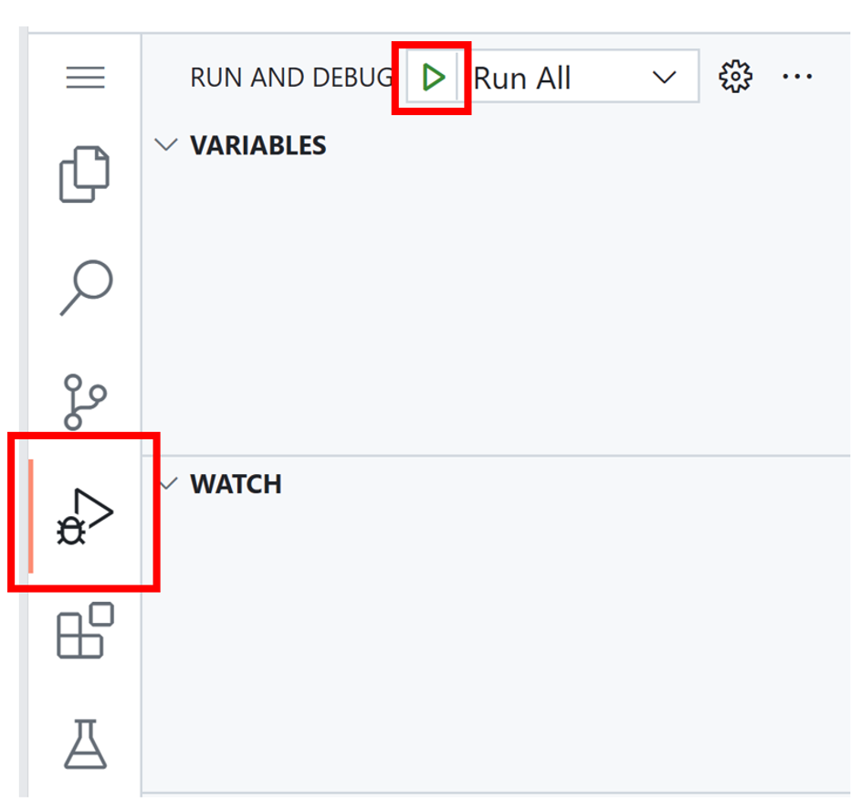
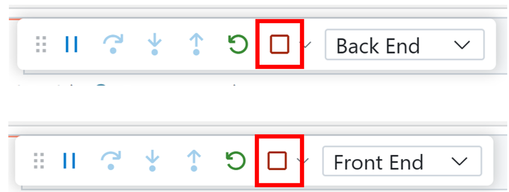

# Financial Planner Interview Exercise

This is an AI-assisted technical interview focused on a full-stack budgeting app.

Your goal as a candidate is to:
- Review the current application behavior.
- Identify and discuss what feels wrong, brittle, or incomplete.
- Implement selected improvements and new features.

## Getting started in GitHub Codespaces

1. Open this repository in GitHub Codespaces.
2. Wait for the dev container setup to finish.
3. In VS Code, click **Run and Debug** and then click **Run All**.
4. Open the forwarded application URL(s) from the **Ports** panel.

### Stop and restart the web app

- To stop: in the VS Code debug toolbar, click **Stop** (you may need to click it for each running process).
- To restart: click **Run All** again.

## Technical asks

### Address customer feedback

1. First click to login doesn't work.
2. When uploading statements, it feels like some transactions are missing.
3. Some of my statements didn't upload. What's going on?

### New feature requests

1. Bulk Upload
2. New Monthly Budget Page
